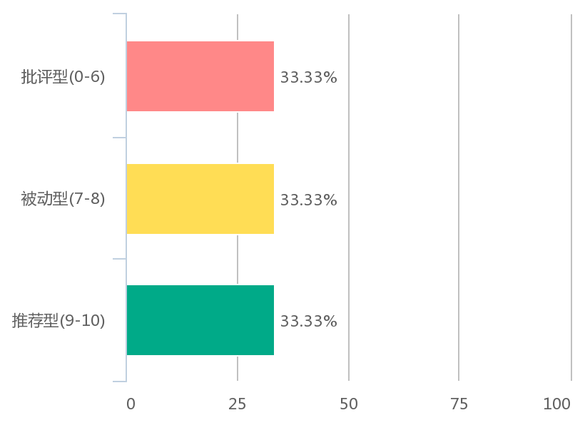
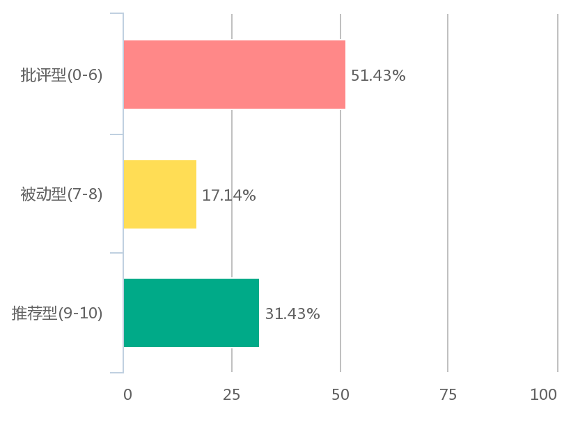

# 项目初步调查问卷统计结果

## 关于批改文字类作业的问卷

### 参与调查的人群

选项|比例
---|---
学生|18.75%
老师|21.88%
家长|54.69%
其他|4.69%
（回答人数：64）

主要人群为中小学生

参与问卷调查的小学老师/学生/家长在全部老师/学生/家长的比例如下表

选项|比例
---|---
学生|72.73%
老师|71.43%
家长|77.13%

****

90%的老师回答他们会经常或是偶尔给学生布置抄写生字或默写课文这类的作业。而超过70%的老师在批改此类作业中关注学生的作业中是否存在错别字以及字体是否美观工整。有50%左右的老师会同时也会关注学生是否完成所有内容以及是否及时上交作业。
****
大多数人认为及时的作业反馈有利于学习

认为及时的作业批改反馈（完成作业当天）更有利于学生学习

****
当问及学生作文中出现错别字的频率时，超过60%的人认为错别字不可避免。

****
关于是否愿意采用将作业通过图片形式上传至网站，有网站帮助查找错别字并反馈信息的回复情况：

老师

学生

家长

通过调查我们发现中小学生确实存在很多书写类的作业，而我们认为这部分作业的批改工作可以由计算机进行文字识别代替人工的批改，这也是我们本项目的出发点。但是在我们初步询问了几位我们认为的目标用户时，他们反馈认为上传图片这样的操作比较麻烦，并且实际收获（查找出错别字）不大，为此不值得使用这样的网站。

在本次人数相较第一次简单询问更多的调查中我们发现不值得进行此类操作仍是很多人给出的反馈，我们还收到了很多有意义的建议和反馈，部分具体反馈如下：

* 我更加看中使用的便捷性和时效性，比如发完图片，可以即时返回结果，这样省时省力又省心。
  
* 我觉得还是通过字典来解决错别字，对孩子对汉字的理解更透彻
  
* 最好是能改作文

* 希望还可以提出具体的提高水平的操作步骤，让孩子能够按着去做并看到进步。

* 提醒孩子易错字的部分

* 担心这种网站会不会造成孩子的依赖，不利于培养他们的自主检查习惯。需要它可以调动孩子为自己作业准确率负责的目的

我们将根据我们初步得到的问卷调查结果进一步改进我们的功能。
